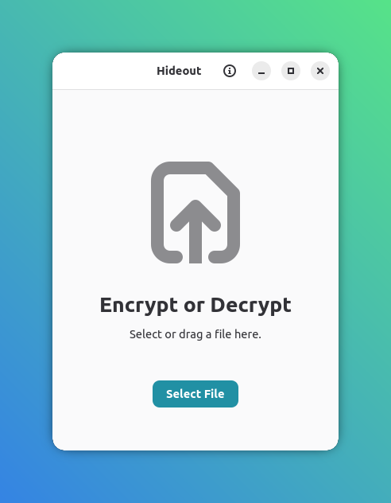

# Hideout

Hideout is a minimal and secure desktop application for file encryption and decryption, powered by [GnuPG](https://gnupg.org/).



## Features

- **Simple UI**: Drag and drop files to encrypt or decrypt.
- **Secure**: Uses GPG symmetric encryption. Passphrases are handled securely.
- **Multi-language**: Supported languages: English, Italian, French, Spanish, German, and Portuguese (BR).

## Prerequisites

- **GnuPG**: You must have `gpg` installed and available in your `PATH`.
- **GTK4 & Libadwaita**: Required for the graphical interface.

## How to Run

You need the [D compiler](https://dlang.org/download.html) and [DUB](https://code.dlang.org/getting_started) installed.

```bash
dub run
```

## Security Note

Hideout uses GPG's symmetric encryption. The passphrase is used to derive a key for encryption. Always use a strong passphrase.

## License

MIT
